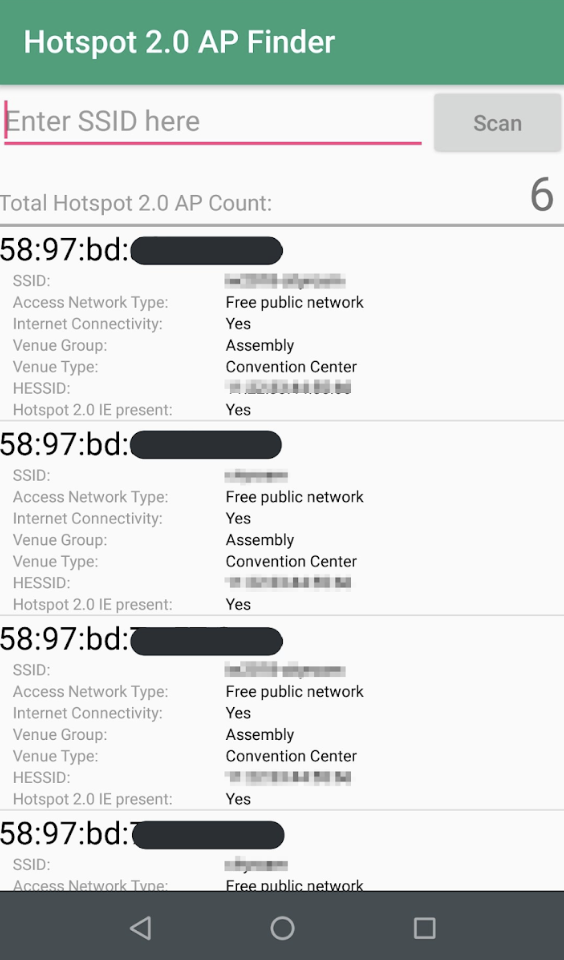

**Hotspot2.0 AP Finder** is an Android application for seeking Hotspot2.0 available access points.
The app displays 

- Textbox is for filtering SSID with given string
- push "Scan" button to renew scan list
